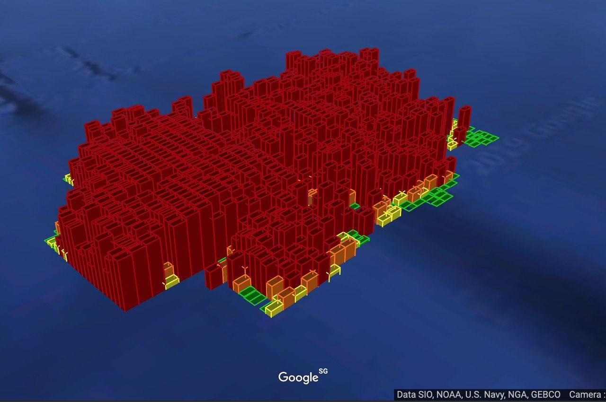
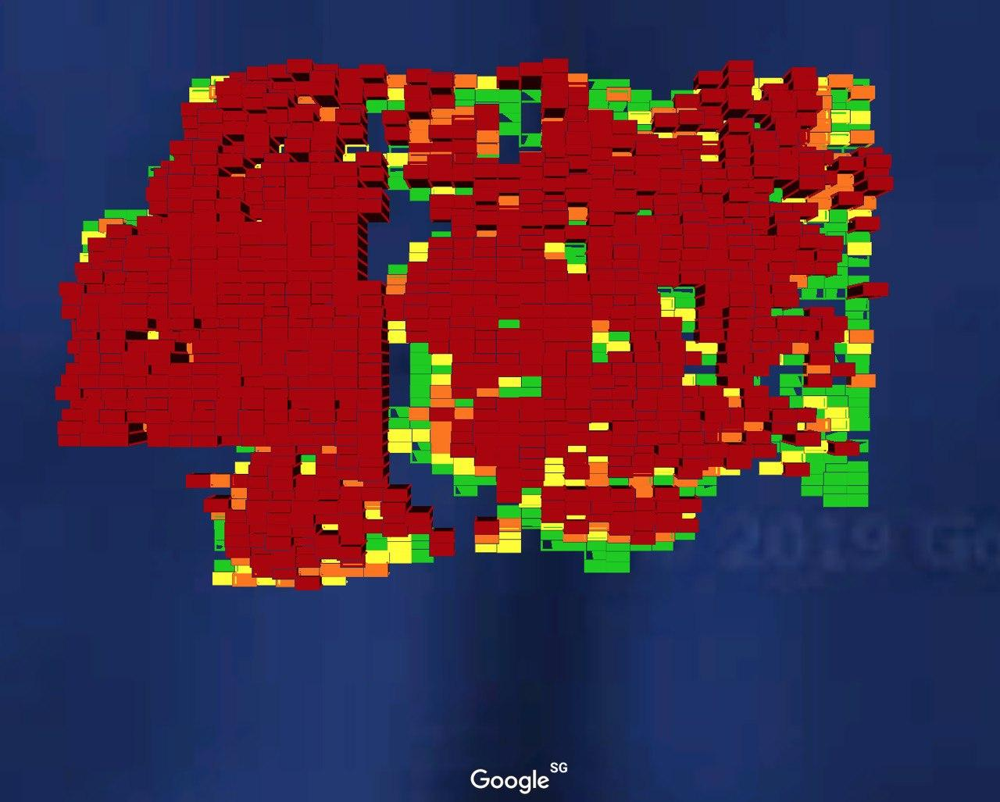

# Challenge: Traffic Management

## Visualization

I rendered the geohash based on occurrence from kml and it looks like:




Check out [generating script](generate_kml.py)!

## Solution

The challenge is:

> The model should be able to accurately forecast ahead by T+1 to T+5 time intervals (where each interval is 15-min) given all data up to time T.

To solve this problem, we will try to use a supervised model according to the [tutorial](https://www.kaggle.com/mahadir/grab-traffic-demand-forecasting). The topology of the model is quite simple - 3 layers of LSTM with BatchNormalization, the results can be polished by optimizing hyperparameters and with more computational resources the model can be improved with more training epoches.

```
pip install -r requirements.txt
python model.py
``` 
